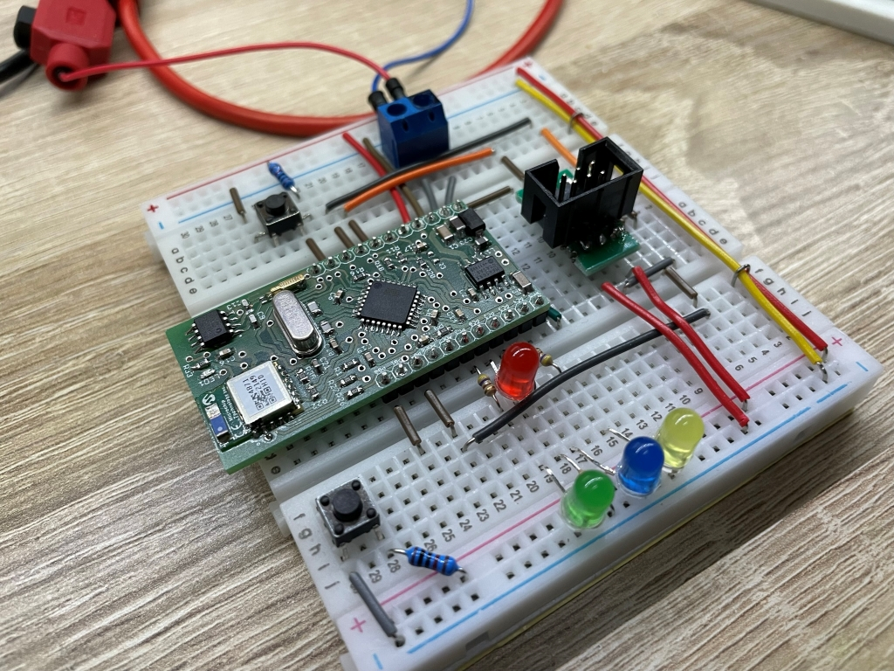

# Examples for the minimized version of the LaRoomy Api

## Description

All examples are written for the example board published in this repository. The projects are created with the Microchip Studio IDE.

A Microchip atmega328p is used in conjunction with a microchip RN4871 Bluetooth Module. The RN4871 is preconfigured with the parameters given on the [root page](https://github.com/LaRoomy/LaRoomy_Min_API) of this repository. All examples are using the power-down sleep mode of the atmega328 and when the RN4871 module is preconfigured for auto-sleep the examples have an average power consumption of ~150µA.

## Examples

### All Simple Properties
> This example uses all properties from simple type. A button, switch, level-selector, level-indicator, text display and an option-selector are added to the api.

### Time-Selector and Time-Frame-Selector
> This example demonstrates the usage of the time specific properties, including how to request the current time from the app when the device is connected. The retrieved time is saved in the Microchip MCP79410 real time clock ic which is also located on the example board.

### Unlock-Control in Standalone-Mode
> This example demonstrates the usage of the Unlock-Control property. Moreover it shows how the standalone mode works, which is available for all complex properties.
