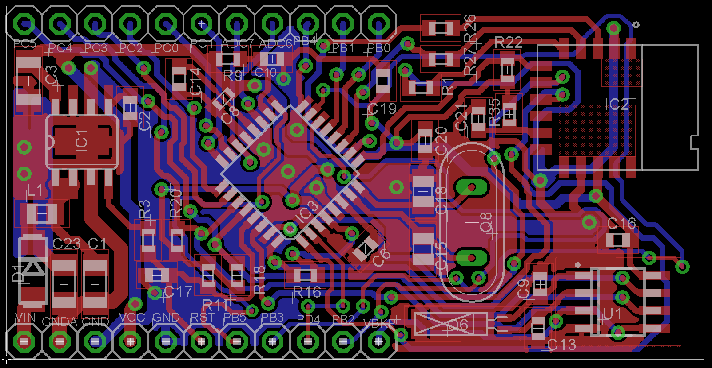
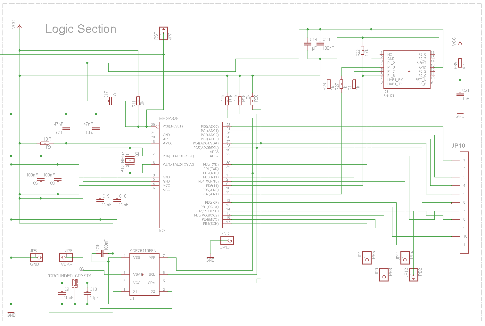
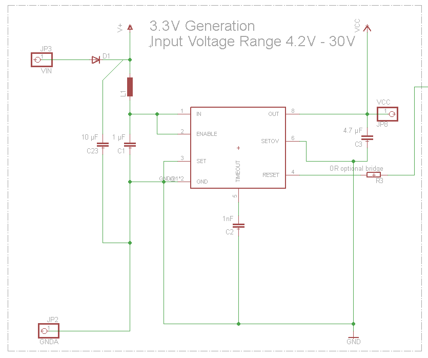
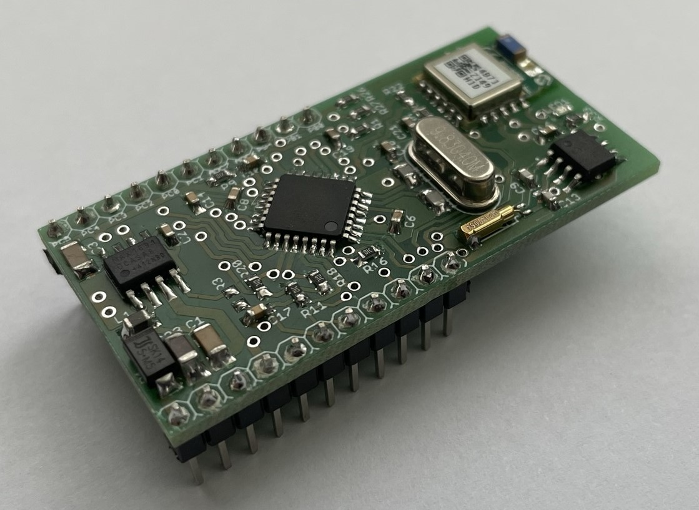

# Common Bluetooth Control Board
The aim of this construction was to create an own development board for the Microchip RN4871. Why doing this? Because all other available boards with bluetooth capabilities are consuming too much current. I wanted something that is tailor made for the LaRoomy Api and has a minimum power consumption.
If the RN4871 is configured in the right way and the power-down sleep mode of the atmega328 is used, the power consumption of the board is lower than 100µA and remains a fully functional and connectable bluetooth device.

This schematic/board is used in all examples in this repository.

If the shutdown mode of the RN4871 is used, the 1Hz square wave interrupt of the Microchip MCP79410 is used to generate a sucessive wakeup condition so that the bluetooth module is only used a short period of a time interval to advertise and may receive a connection and the input voltage regulator is not used (for example by powering through a micro cell battery), the current consumption can be reduced to an average value of 5µA.

## Board

## Schematic

Logic Section:

3.3V Power Generation:

## Final assembly

